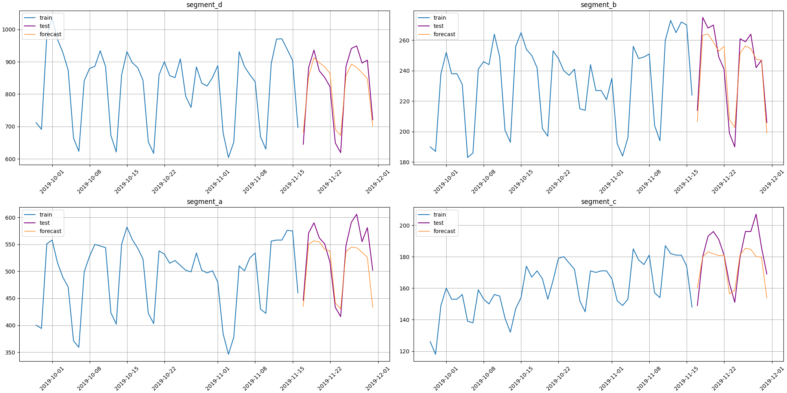

<div align="center">

</div>

<h3 align="center">Predict your time series the easiest way</h3>

<p align="center">
  <a href="https://pypi.org/project/etna/"></a>
  <a href="https://pypi.org/project/etna/"></a>
  <a href="https://pepy.tech/project/etna"></a>
</p>
 
<p align="center">
  <a href="https://codecov.io/gh/tinkoff-ai/etna"></a>
  <a href="https://github.com/tinkoff-ai/etna/actions/workflows/test.yml?query=branch%3Amaster++"></a>
  <a href="https://github.com/tinkoff-ai/etna/actions/workflows/publish.yml"></a>
  <a href="https://github.com/tinkoff-ai/etna/blob/master/LICENSE"></a>
</p>

<p align="center">
  <a href="https://t.me/etna_support"></a>
  <a href="https://github.com/tinkoff-ai/etna/discussions"></a>
  <a href="https://github.com/tinkoff-ai/etna/graphs/contributors"></a>
  <a href="https://github.com/tinkoff-ai/etna/stargazers"></a>
</p>

<p align="center">
  <a href="https://etna.tinkoff.ru">Homepage</a> | 
  <a href="https://etna-docs.netlify.app/">Documentation</a> |
  <a href="https://github.com/tinkoff-ai/etna/tree/master/examples">Tutorials</a> |
  <a href="https://github.com/tinkoff-ai/etna/blob/master/CONTRIBUTING.md">Contribution Guide</a> |
  <a href="https://github.com/tinkoff-ai/etna/releases">Release Notes</a>
</p>
  
ETNA is an easy-to-use time series forecasting framework. 
It includes built in toolkits for time series preprocessing, feature generation, 
a variety of predictive models with unified interface - from classic machine learning
to SOTA neural networks, models combination methods and smart backtesting.
ETNA is designed to make working with time series simple, productive, and fun. 

ETNA is the first python open source framework of 
[Tinkoff.ru](https://www.tinkoff.ru/eng/)
Artificial Intelligence Center. 
The library started as an internal product in our company - 
we use it in over 10+ projects now, so we often release updates. 
Contributions are welcome - check our [Contribution Guide](https://github.com/tinkoff-ai/etna/blob/master/CONTRIBUTING.md).

## Get started

Let's load and prepare the data.
```python
import pandas as pd
from etna.datasets import TSDataset

# Read the data
df = pd.read_csv("examples/data/example_dataset.csv")

# Create a TSDataset
df = TSDataset.to_dataset(df)
ts = TSDataset(df, freq="D")

# Choose a horizon
HORIZON = 14

# Make train/test split
train_ts, test_ts = ts.train_test_split(test_size=HORIZON)
```

Define transformations and model:
```python
from etna.models import CatBoostMultiSegmentModel
from etna.transforms import DateFlagsTransform
from etna.transforms import DensityOutliersTransform
from etna.transforms import FourierTransform
from etna.transforms import LagTransform
from etna.transforms import LinearTrendTransform
from etna.transforms import MeanTransform
from etna.transforms import SegmentEncoderTransform
from etna.transforms import TimeSeriesImputerTransform
from etna.transforms import TrendTransform

# Prepare transforms
transforms = [
    DensityOutliersTransform(in_column="target", distance_coef=3.0),
    TimeSeriesImputerTransform(in_column="target", strategy="forward_fill"),
    LinearTrendTransform(in_column="target"),
    TrendTransform(in_column="target", out_column="trend"),
    LagTransform(in_column="target", lags=list(range(HORIZON, 122)), out_column="target_lag"),
    DateFlagsTransform(week_number_in_month=True, out_column="date_flag"),
    FourierTransform(period=360.25, order=6, out_column="fourier"),
    SegmentEncoderTransform(),
    MeanTransform(in_column=f"target_lag_{HORIZON}", window=12, seasonality=7),
    MeanTransform(in_column=f"target_lag_{HORIZON}", window=7),
]

# Prepare model
model = CatBoostMultiSegmentModel()
```

Fit `Pipeline` and make a prediction:
```python
from etna.pipeline import Pipeline

# Create and fit the pipeline
pipeline = Pipeline(model=model, transforms=transforms, horizon=HORIZON)
pipeline.fit(train_ts)

# Make a forecast
forecast_ts = pipeline.forecast()
```

Let's plot the results:
```python
from etna.analysis import plot_forecast

plot_forecast(forecast_ts=forecast_ts, test_ts=test_ts, train_ts=train_ts, n_train_samples=50)
```



Print the metric value across the segments:
```python
from etna.metrics import SMAPE

metric = SMAPE(mode="macro")
metric_value = metric(y_true=test_ts, y_pred=forecast_ts)
>>> {'segment_b': 3.3017151519000967, 'segment_c': 5.270557433427279, 'segment_a': 5.272811627335398, 'segment_d': 4.689085450895735}
```

## Installation 

ETNA is available on [PyPI](https://pypi.org/project/etna), so you can use `pip` to install it.

Install default version:
```bash
pip install --upgrade pip
pip install etna
```

The default version doesn't contain all the dependencies, because some of them are needed only for specific models, e.g. Prophet, PyTorch.
Available user extensions are the following:
* `prophet`
* `torch`
* `wandb`

Install extension:
```bash
pip install etna[extension-name]
```

Install all extensions:
```bash
pip install etna[all]
```

There are also developer extensions. All the extensions are listed in [`pyproject.toml`](https://github.com/tinkoff-ai/etna/blob/master/pyproject.toml#L93).

Without the appropriate extension you will get an `ImportError` trying to import the model that needs it.
For example, `etna.models.ProphetModel` needs `prophet` extension and can't be used without it.

### Configuration

ETNA supports configuration files. It means that library will check that all the specified packages are installed prior to script start and NOT during runtime. 

To set up a configuration for your project you should create a `.etna` file at the project's root. To see the available options look at [`Settings`](https://github.com/tinkoff-ai/etna/blob/master/etna/settings.py#L68). There is an [example](https://github.com/tinkoff-ai/etna/tree/master/examples/configs/.etna) of configuration file.

## Tutorials

We have also prepared a set of tutorials for an easy introduction:

| Notebook     | Interactive launch  |
|:----------|------:|
| [Get started](https://github.com/tinkoff-ai/etna/tree/master/examples/get_started.ipynb) | [](https://mybinder.org/v2/gh/tinkoff-ai/etna/master?filepath=examples/get_started.ipynb) |
| [Backtest](https://github.com/tinkoff-ai/etna/tree/master/examples/backtest.ipynb) | [](https://mybinder.org/v2/gh/tinkoff-ai/etna/master?filepath=examples/backtest.ipynb) |
| [EDA](https://github.com/tinkoff-ai/etna/tree/master/examples/EDA.ipynb) | [](https://mybinder.org/v2/gh/tinkoff-ai/etna/master?filepath=examples/EDA.ipynb) |
| [Outliers](https://github.com/tinkoff-ai/etna/tree/master/examples/outliers.ipynb) | [](https://mybinder.org/v2/gh/tinkoff-ai/etna/master?filepath=examples/outliers.ipynb) |
| [Clustering](https://github.com/tinkoff-ai/etna/tree/master/examples/clustering.ipynb) | [](https://mybinder.org/v2/gh/tinkoff-ai/etna/master?filepath=examples/clustering.ipynb) |
| [Deep learning models](https://github.com/tinkoff-ai/etna/tree/master/examples/NN_examples.ipynb) | [](https://mybinder.org/v2/gh/tinkoff-ai/etna/master?filepath=examples/NN_examples.ipynb) |
| [Ensembles](https://github.com/tinkoff-ai/etna/tree/master/examples/ensembles.ipynb) | [](https://mybinder.org/v2/gh/tinkoff-ai/etna/master?filepath=examples/ensembles.ipynb) |
| [Custom Transform and Model](https://github.com/tinkoff-ai/etna/tree/master/examples/custom_transform_and_model.ipynb) | [](https://mybinder.org/v2/gh/tinkoff-ai/etna/master?filepath=examples/custom_transform_and_model.ipynb) |
| [Exogenous data](https://github.com/tinkoff-ai/etna/tree/master/examples/exogenous_data.ipynb) | [](https://mybinder.org/v2/gh/tinkoff-ai/etna/master?filepath=examples/exogenous_data.ipynb) |
| [Forecasting strategies](https://github.com/tinkoff-ai/etna/blob/master/examples/forecasting_strategies.ipynb) | [](https://mybinder.org/v2/gh/tinkoff-ai/etna/master?filepath=examples/forecasting_strategies.ipynb) |
| [Classification](https://github.com/tinkoff-ai/etna/blob/master/examples/classification.ipynb) | [](https://mybinder.org/v2/gh/tinkoff-ai/etna/master?filepath=examples/classification.ipynb) |
| [Hierarchical time series](https://github.com/tinkoff-ai/etna/blob/master/examples/hierarchical_pipeline.ipynb) | [](https://mybinder.org/v2/gh/tinkoff-ai/etna/master?filepath=examples/hierarchical_pipeline.ipynb) |

## Documentation

ETNA documentation is available [here](https://etna-docs.netlify.app/).

## Community

To ask the questions or discuss the library you can join our [telegram chat](t.me/etna_support). 
[Discussions section](https://github.com/tinkoff-ai/etna/discussions) on github is also open for this purpose.

## Resources

- [Forecasting with ETNA: Fast and Furious](https://medium.com/its-tinkoff/forecasting-with-etna-fast-and-furious-1b58e1453809) on Medium

- [ETNA Regressors](https://medium.com/its-tinkoff/etna-regressors-d2722923e88e) on Medium

- [Time series forecasting with ETNA: first steps](https://medium.com/its-tinkoff/time-series-forecasting-with-etna-first-steps-dfaf90c5b919) on Medium

- [ETNA: Time Series Analysis. What, why and how?](https://medium.com/its-tinkoff/etna-time-series-analysis-what-why-and-how-e45557af4f6c) on Medium

- [Tabular Playground Series - Mar 2022 (7th place!)](https://www.kaggle.com/code/chikovalexander/tps-mar-2022-etna/notebook?scriptVersionId=91575908) on Kaggle

- [Store sales prediction with etna library](https://www.kaggle.com/dmitrybunin/store-sales-prediction-with-etna-library?scriptVersionId=81104235) on Kaggle

- [Tabular Playground Series - Jan 2022](https://www.kaggle.com/code/chikovalexander/tps-jan-2022-etna/notebook) on Kaggle

- [EDA notebook for Ubiquant Market Prediction](https://www.kaggle.com/code/martins0n/ubiquant-eda-toy-predictions-etna) on Kaggle

- [PyCon Russia September 2021 talk](https://youtu.be/VxWHLEFgXnE) on YouTube

- [ETNA Meetup Jun 2022](https://www.youtube.com/watch?v=N1Xy3EqY058&list=PLLrf_044z4JrSsjMd-3dF6VbBLPI_yOxG) on YouTube

- [DUMP May 2022 talk](https://youtu.be/12uuxepdtks) on YouTube
 
## Acknowledgments

### ETNA.Team

[Andrey Alekseev](https://github.com/iKintosh),
[Nikita Barinov](https://github.com/diadorer),
[Dmitriy Bunin](https://github.com/Mr-Geekman),
[Aleksandr Chikov](https://github.com/alex-hse-repository),
[Vladislav Denisov](https://github.com/v-v-denisov),
[Martin Gabdushev](https://github.com/martins0n),
[Sergey Kolesnikov](https://github.com/Scitator),
[Artem Makhin](https://github.com/Ama16),
[Ivan Mitskovets](https://github.com/imitskovets),
[Albina Munirova](https://github.com/albinamunirova),
[Julia Shenshina](https://github.com/julia-shenshina),
[Yuriy Tarasyuk](https://github.com/DBcreator),
[Konstantin Vedernikov](https://github.com/scanhex12)

### ETNA.Contributors

[WinstonDovlatov](https://github.com/WinstonDovlatov),
[mvakhmenin](https://github.com/mvakhmenin),
[Carlosbogo](https://github.com/Carlosbogo),
[Pacman1984](https://github.com/Pacman1984),
[looopka](https://github.com/looopka),
[Artem Levashov](https://github.com/soft1q),
[Aleksey Podkidyshev](https://github.com/alekseyen)

## License

Feel free to use our library in your commercial and private applications.

ETNA is covered by [Apache 2.0](/LICENSE). 
Read more about this license [here](https://choosealicense.com/licenses/apache-2.0/)

> Please note that `etna[prophet]` is covered by [GPL 2.0](https://www.gnu.org/licenses/old-licenses/gpl-2.0.html) due to pystan package.
