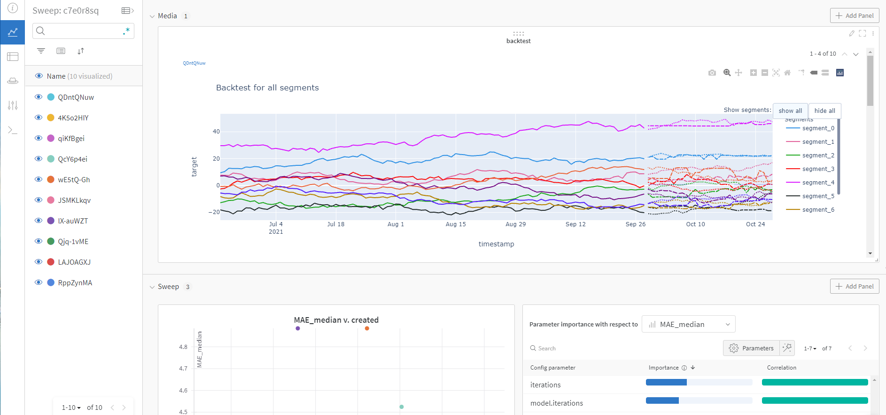

# Using Weights & Biases with ETNA library


[Sweep Dashboard](https://wandb.ai/martins0n/wandb-etna-sweep/sweeps/c7e0r8sq/overview?workspace=user-martins0n)

## Steps to start

- We will use [Hydra](https://hydra.cc/) to manage our command-line application.

- Define your pipeline and hyperparameters in `config.yaml`, in example we will optimize number of iterations `iterations`, `depth` and number of `lags` for `CatBoostMultiSegmentModel`

- Define WandB sweeps config `sweep.yaml` and push it to cloud:

```bash
WANDB_PROJECT=<project_name> wandb sweep sweep.yaml 
```

- You may change `dataloader` function and add additional parameters for WandB logger like tags for example in `sweeps_example.py`

- Run WandB agent for hyperparameters optimization start:

```bash
wandb agent <user_name>/<project_name>/<sweep_id>
```
